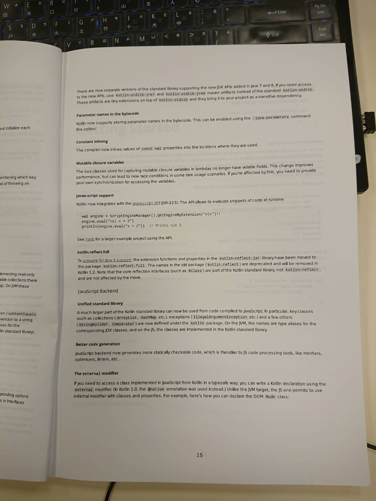
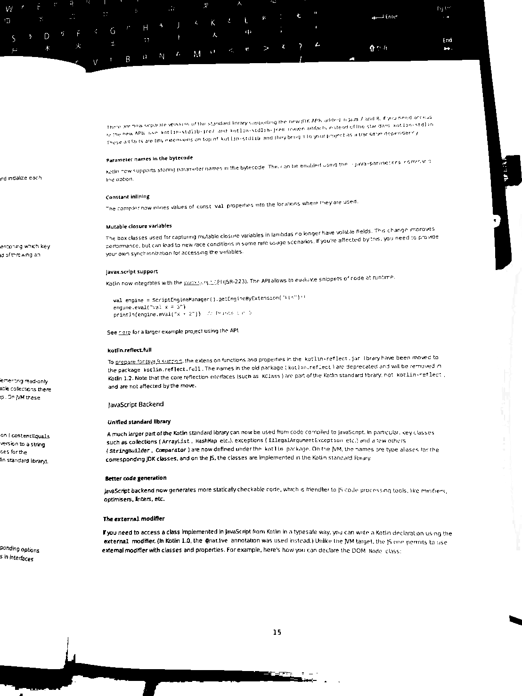

# imageFilter
Transform camera image to black and white like printer scan.

這是一個簡單的Demo，因為我其實對於這些濾鏡也很不了解，所以沒有辦法真的調整得非常好，請見諒。
我這邊先用相機隨便拍一個文件。

可以看到說這張照片其實有一點昏暗，拍攝的狀況並不十分理想。 那麼我這邊套用了兩種濾鏡。 成果如下

其實轉完之後有些字有點糊掉了，但是要把字調整得非常清晰，也會視每張圖的情況來看，那以下就來大概說明一下我做了什麼事情。

