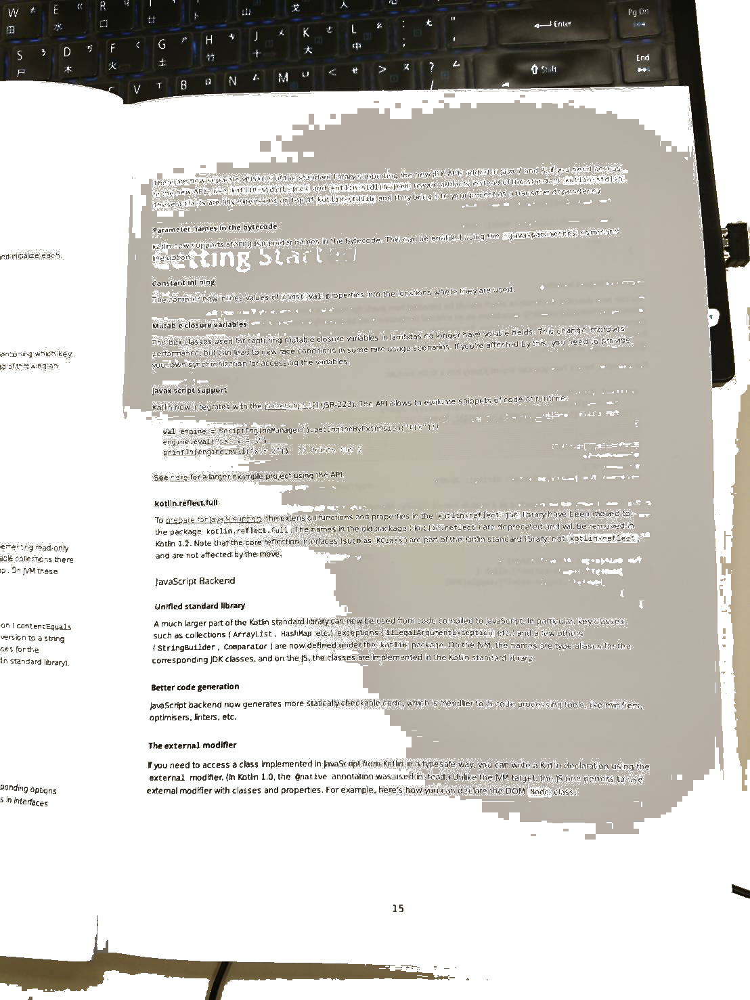
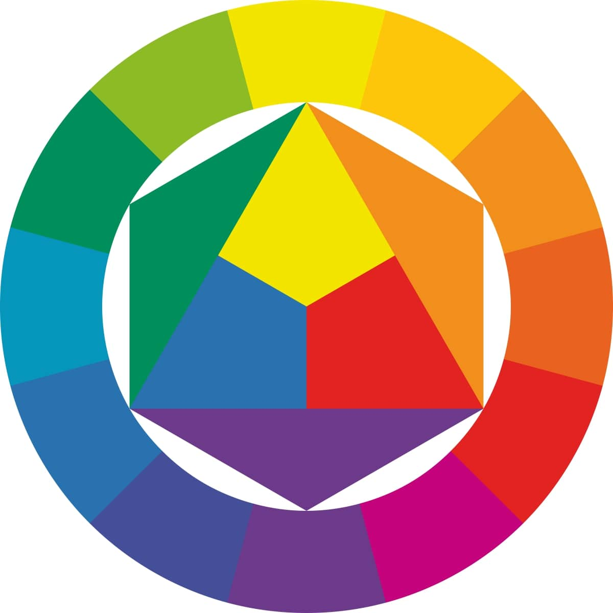
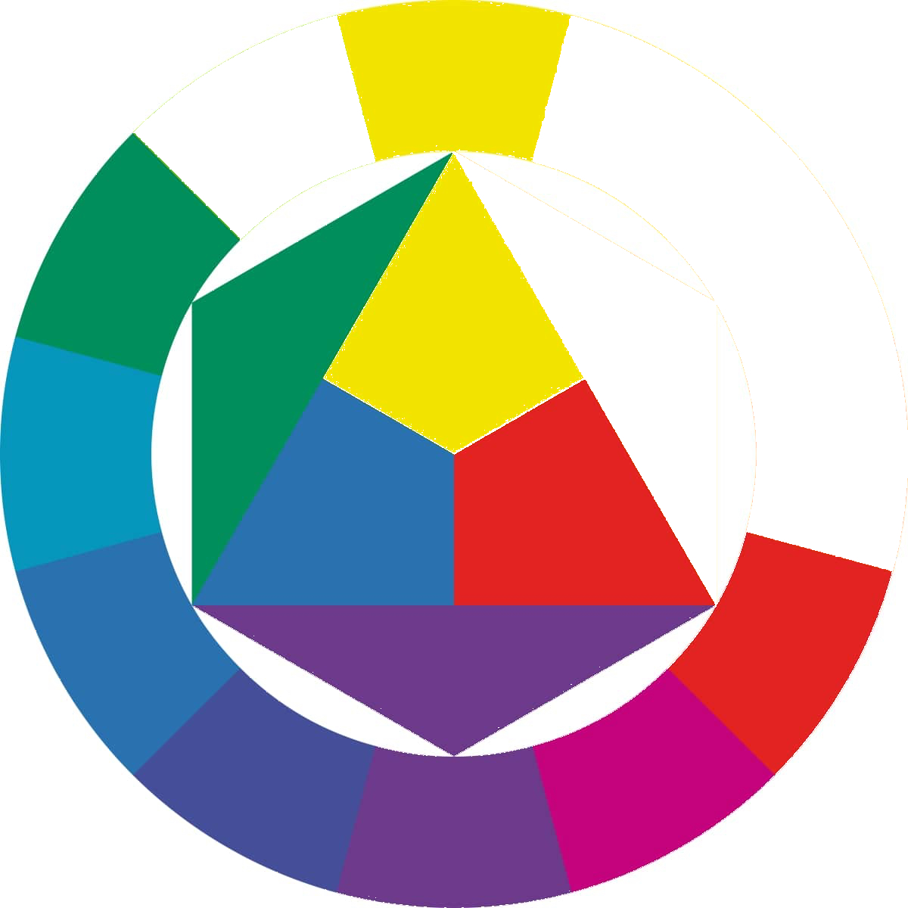

# imageFilter
Transform camera image to black and white like printer scan.

這是一個簡單的Demo，因為我其實對於這些濾鏡也很不了解，所以沒有辦法真的調整得非常好，請見諒。
我這邊先用相機隨便拍一個文件。


可以看到說這張照片其實有一點昏暗，拍攝的狀況並不十分理想。 那麼我這邊套用了兩種濾鏡。 成果如下


其實轉完之後有些字有點糊掉了，但是要把字調整得非常清晰，也會視每張圖的情況來看，那以下就來大概說明一下我做了什麼事情。

首先我在這裡套用了兩次濾鏡  原圖 > 消除陰影 > 畫面轉換成黑白
在消除陰影的部分呢，我把比較不黑的顏色都直接遮蓋掉了看到只做第一個步驟的結果如下


其實可以看到說我在這個步驟就把上面的文字遮蓋掉了一些，這個步驟的程式碼如下  
  
```swift
private func masklightToMidRangeBrown(inputImage: UIImage) -> UIImage? {
    let myColorMaskedImage = inputImage.cgImage?.copy(maskingColorComponents: [100, 180,  100, 180, 20, 180])!  //[124, 255,  68, 222, 0, 165]
    let context = CIContext()
    let temp = convertCGImageToCIImage(cgImage: myColorMaskedImage!)
    if let cgimg = context.createCGImage(temp, from: temp.extent) {
        return UIImage(cgImage: cgimg)
    }
    return nil
}
```
  
看到maskingColorComponents這邊有一個連續六個數字的陣列，這些數字兩兩一組代表的部分為[ R_LOW, R_HIGH, G_LOW, G_HIGH, B_LOW, B_HIGH]
我這樣的說明相信現在還是一頭霧水這邊我用一個範例圖片來做介紹，下方是一個常見的多種顏色範例
  
  
有關於這個陣列的部分，我們先試者直接用原本的設定來跑跑看，跑完發現咦完全沒有改變啊，為什麼要欺騙大家的感情。 
讓我先來稍微改變這個陣列的部分，將這個陣列換成
```
[0, 255,  0, 255, 0, 255]
```
再來執行看看結果如下  
  
恩一片空白呢，絕對不是各位被耍了，因為這個遮罩的目的就是要把所有的顏色都遮掉，這個矩陣可以解說成`我們要遮蓋掉R:0~255 G:0~255 B:0~255的顏色區段`，所以說也就是所有的顏色區段，不管用任何圖片如果我們套用這個設定，就會變成一片空白，宛若潔白的畫布。  
那接下來我再來嘗試一個陣列  
```
[124, 255,  68, 222, 0, 165]
```
  

可以看到橘色的部分還有一些會用到R的綠色被遮蓋掉了，不過具體怎麼遮顏色範圍就要在自己多嘗試了，如果把部分設定成 `[ 0, 0]`會導致整個遮罩無效，需要注意。

接下來就是將圖片轉換成純的黑跟白色，這邊我們就調整一下亮度飽和度跟對比，我設定的參數部份如下
```swift
filter?.setValue(coreImage, forKey: kCIInputImageKey)
//Key value are changable according to your need.

filter?.setValue(7, forKey: kCIInputContrastKey)
filter?.setValue(0, forKey: kCIInputSaturationKey)
filter?.setValue(1.2, forKey: kCIInputBrightnessKey)
```
  
以上就是我將圖票轉換成像印表機掃描般的過程，不過顏色遮罩的部分我一直沒辦法調整得非常棒，如果有人有嘗試出比較好的數值，麻煩再告訴我吧。